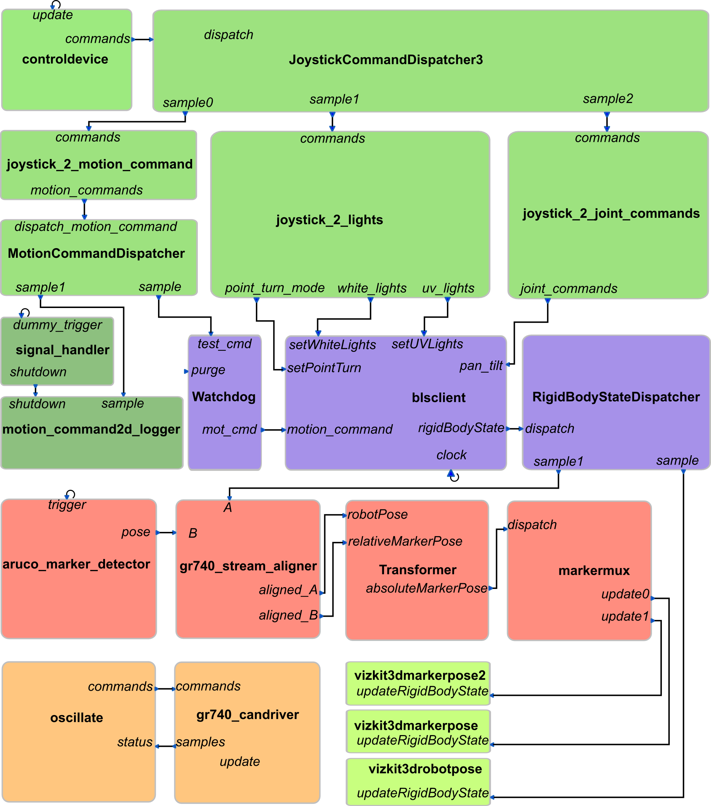

# Planetary Exploration Demonstrator

# Architecture

# Taste Interface

# Issues

In any case there is a GR740 communicating with a x86 partition, all involved interface parameters have to be encoded using **UPER**.
Otherwise there will be endianess and conversion issues.
